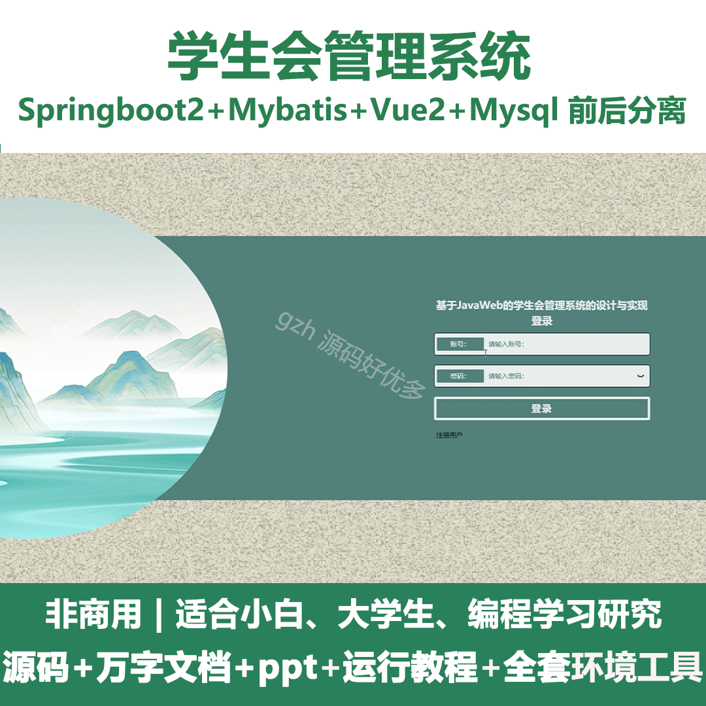
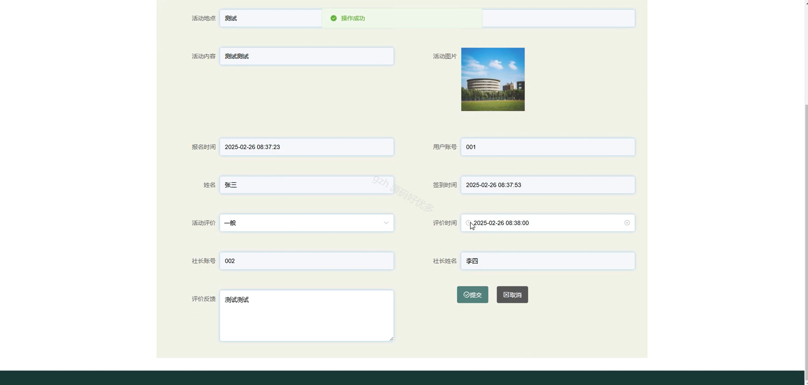

# springbootA522D
springbootA522D学生会管理系统+LW+PPT
 
## 查看主页获取源码

### 一、关键词
活动信息管理、报名信息管理、成员信息管理

### 二、作品包含
源码+数据库+设计文档万字+ppt+全套环境和工具资源+本地部署教程

### 三、项目技术
前端技术：Html、Css、Js、Vue2.0、Element-ui 
后端技术：Java、SpringBoot2.0、MyBatis

### 四、运行环境（以下版本亲测，其他版本未知，请自测）
开发工具：IDEA/eclipse  + VSCODE

数据库：MySQL5.7（最低要5.7版本）

数据库管理工具：Navicat10以上版本

环境配置软件： JDK1.8 + Maven3.6.3

前端Nodejs：14

浏览器：谷歌浏览器

### 五、项目介绍
项目编号：springbootA522D

学生会管理系统可借助活动、报名等信息管理及社长、用户等管理功能，实现学生会工作的数字化、规范化高效管理。

角色：管理员、用户、社长

管理员：系统首页、个人中心、社长管理、用户管理、活动类型管理、活动信息管理、报名信息管理、签到信息管理、评价信息管理、通知公告管理、成员信息管理、系统管理。

用户：系统首页、活动信息、通知公告、校园资讯、个人中心、修改密码、报名信息、签到信息、评价信息、我的收藏。

社长：系统首页、个人中心、活动信息管理、报名信息管理、签到信息管理、评价信息管理、通知公告管理、成员信息管理。

### 六、运行截图

